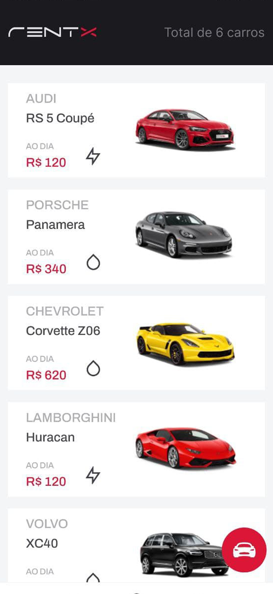
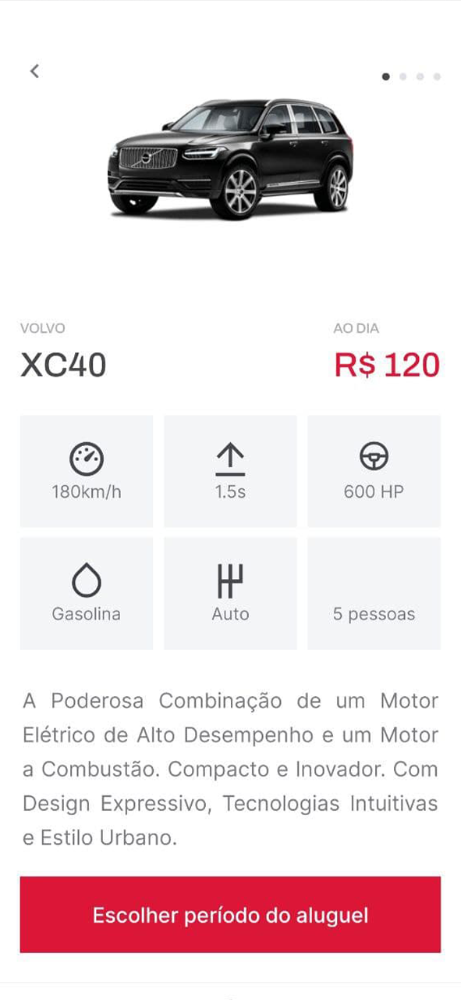
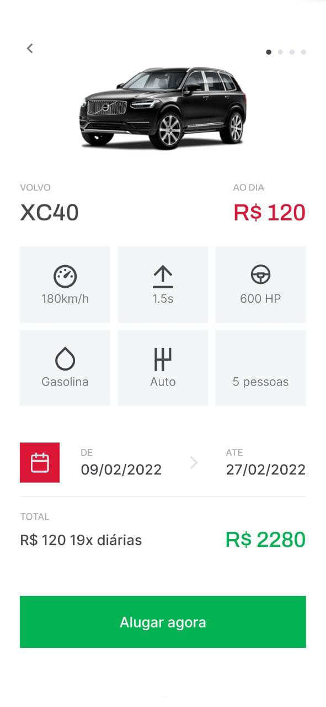
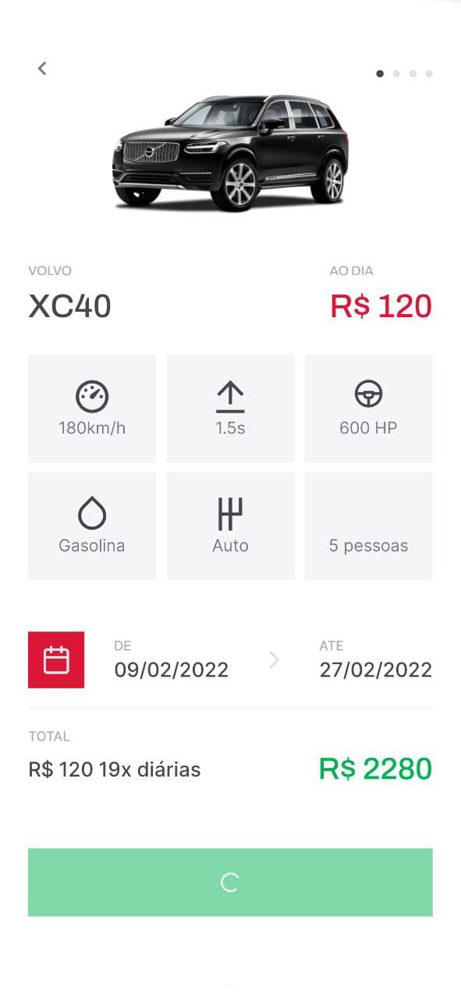
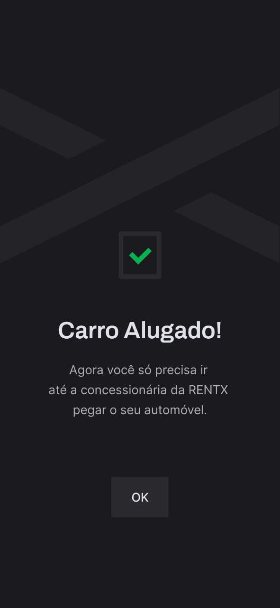
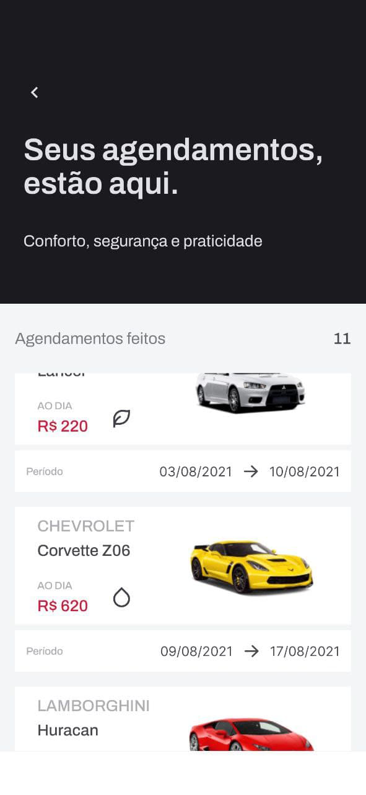

<h1 align="center">
  
</h1>

<p align="center">
  

 
</p>

<div display: flex align="center">







</div>

## 💻 Projeto

O RentX é um app para fazer agendamentos de carros com uma interface otimista

## ✨ Tecnologias

- [x] Expo
- [x] Typescript
- [x] Axios
- [x] Styled Components

## Executando o projeto

Utilize o **yarn** ou o **npm install** para instalar as dependências do projeto.
Em seguida, abra dois terminais, o primeiro execute a api, em seguida execute o aplicativo.

Executando a api
```cl
yarn api
```

Executando o aplicativo
```cl
yarn start
```

</br>

## 📄 Licença

Esse projeto está sob a licença MIT. Veja o arquivo [LICENSE](LICENSE.md) para mais detalhes.

<br />

<div align="center">
  <p>Desenvolvido por Daniel Machado</p>

  [](https://www.linkedin.com/in/daniel-machado-5a8b9413a/) 
</div>